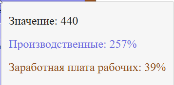

# Диаграмма Сэнкей / Sankey 

## Обзор

`om_charts_sankey` — это React-компонент для создания диаграмм Сэнкей. Этот пакет предоставляет простую интеграцию диаграммы в React-приложениях, работающих в эко системе Оптимакрос.


## Установка

```sh
npm install om_charts_sankey
```

или с помощью Yarn:

```sh
yarn add om_charts_sankey
```

## Использование

Импортируйте и используйте компонент Sankey в своем React-приложении:

```tsx
import { Sankey } from 'om_charts_sankey';

const data: SankeyDatum = {
  nodes: [
    { name: 'Источник A', color: "#79a4d2" },
    { name: 'Цель B', color: "#40bf4d" },
    { name: 'Цель С', color: "#3a7872" },
    { name: 'Цель D', color: "#40b5bf" }
  ],
  links: [
    { source: 'Источник A', target: 'Цель B', value: 30 },
    { source: 'Цель B', target: 'Цель С', value: 20 },
    { source: 'Цель B', target: 'Цель D', value: 10 },
  ]
}

const setting: Settings = {
	...
	needTooltip: true,
}

const App = () => {
  return (
      <Sankey
			datum={data}
			setting={setting}
			width={600}
			height={400} />
  )
}

export default App;
```

## Свойства компонента Sankey

| Свойство  | Тип    | По умолчанию   | Описание                                             |
| --------- | ------ | -------------- | ---------------------------------------------------- |
| `datum`   | Объект | Обязательно    | Данные Sankey-диаграммы с  полями `nodes` и `links`. |
| `setting` | Объект | Не обязательно | Пользовательские настройки графика и тултипа         |
| `width`   | Число  | 900            | Ширина диаграммы                                     |
| `height`  | Число  | 500            | Высота диаграммы.                                    |
## Данные для диаграммы 

Данные для построения для диаграммы Сэнкей имеют свои особенности и должны состоять из двух массивов:
- массив **nodes**  содержит список уникальных узлов. Цвета узлов являются не обязательными, если Вы их не укажете, то диаграмма построится на дефолтных для нее цветах
- массив **links** содержит указания на источник линии связи  (source) и цель (target), а также значение потока (value) 

**Важно:**
В случае если массив links будет содержать циклические ссылки на источник и связи, то диаграмма не будет построена и Вы получите пустой холст
```js
const data = {
  nodes: [
    { name: 'Источник A' },
    { name: 'Цель B' },
  ],
  links: [
    { source: 'Источник A', target: 'Цель B', value: 30 },
    { source: 'Цель B', target: 'Источник A', value: 20 }, 
  ]
}
```

Если значения value в links будут меньше или равны 0, или иметь не числовой формат, то они будут игнорироваться
```js
const data = {
  nodes: [
    { name: 'Источник A', color: "#79a4d2" },
    { name: 'Цель B', color: "#40bf4d" },
    { name: 'Цель С', color: "#3a7872" },
    { name: 'Цель D', color: "#40b5bf" }
  ],
  links: [
    { source: 'Источник A', target: 'Цель B', value: -30 }, // игнорируется
    { source: 'Цель B', target: 'Цель С', value: 0 }, // игнорируется
    { source: 'Цель B', target: 'Цель D', value: false }, // игнорируется
  ]
}
```

## Свойства объекта настроек settings

Все настройки, как и весь объект settings, являются не обязательными. В случае отсутствия настроек диаграмма будет учитывать дефолтные значения, указанные ниже

| Свойство           | Тип                                                                          | По умолчанию     | Описание                                                                                               |
| ------------------ | ---------------------------------------------------------------------------- | ---------------- | ------------------------------------------------------------------------------------------------------ |
| `colorMode`        | 'source' \| 'target'                                                         | `source`         | Определяет режим цвета линий связей. 'source'  - цвет определяется цветом источником, 'target' - целью |
| `lang`             | 'ru' \| 'en' \| 'de' \| 'tr',                                                | 'ru'             | Язык интерфейса для отображения надписей на графике                                                    |
| `nodeAlign`        | 'sankeyLeft' \| <br>'sankeyRight' \|<br>'sankeyCenter' \|<br>'sankeyJustify' | 'sankeyJustify'  | Определяет выравнивание узлов                                                                          |
| `needTooltip`      | Логический                                                                   | `false`          | Включает/отключает тултип.                                                                             |
| `nodesSortingType` | 'withoutSorting' \| 'ascending' \| 'descending'                              | 'withoutSorting' | Определяет порядок сортировки узлов.                                                                   |
| `linksSortingType` | 'withoutSorting' \| 'ascending' \| 'descending'                              | 'withoutSorting' | Определяет порядок сортировки связей.                                                                  |
| `showLinkTooltip`  | Объект                                                                       | См. ниже         | Настройки тултипов для связей.                                                                         |
| `showNodeTooltip`  | Объект                                                                       | См. ниже         | Настройки тултипов для узлов.                                                                          |
| `tooltipColors`    | Объект                                                                       | См. ниже         | Цвета тултипов.                                                                                        |
| `text`             | Объект                                                                       | См. ниже         | Настройки отображения текста.                                                                          |

#### `showLinkTooltip`
Данная настройка определяет внешний вид тултипа при наведении на линии связи между узлами

#### Внешний вид тултипа



| Свойство           | Тип        | По умолчанию | Описание                      |
| ------------------ | ---------- | ------------ | ----------------------------- |
| `value`            | Логический | `false`      | Показывать значение связи.    |
| `sourceName`       | Логический | `false`      | Показывать имя источника.     |
| `sourcePercentage` | Логический | `false`      | Показывать процент источника. |
| `linkName`         | Логический | `false`      | Показывать имя связи.         |
| `linkPercentage`   | Логический | `false`      | Показывать процент связи.     |

#### `showNodeTooltip`

Данная настройка определяет внешний вид тултипа при наведении на  узлы


| Свойство             | Тип        | По умолчанию | Описание                             |
| -------------------- | ---------- | ------------ | ------------------------------------ |
| `name`               | Логический | `false`      | Показывать имя узла.                 |
| `value`              | Логический | `false`      | Показывать значение узла.            |
| `incomeName`         | Логический | `false`      | Показывать имя входящих узлов.       |
| `incomeValue`        | Логический | `false`      | Показывать значение входящих узлов.  |
| `incomePercentage`   | Логический | `false`      | Показывать процент входящих узлов.   |
| `outgoingName`       | Логический | `false`      | Показывать имя исходящих узлов.      |
| `outgoingValue`      | Логический | `false`      | Показывать значение исходящих узлов. |
| `outgoingPercentage` | Логический | `false`      | Показывать процент исходящих узлов.  |
#### `tooltipColors`

| Свойство         | Тип    | По умолчанию | Описание                              |
| ---------------- | ------ | ------------ | ------------------------------------- |
| `labels`         | строка | #010409      | Цвет основного значения тултипа узла  |
| `linkText`       | строка | #212121      | Цвет основного значения тултипа связи |
| `decrementColor` | строка | #B22222      | Цвет входящих исходящих тултипа связи |
| `incrementColor` | строка | #228B22      | Цвет входящих значений тултипа связи  |
#### `text`

| Свойство    | Тип        | По умолчанию | Описание                  |
| ----------- | ---------- | ------------ | ------------------------- |
| `showName`  | Логический | `false`      | Показывать имя узла.      |
| `showValue` | Логический | `false`      | Показывать значение узла. |
